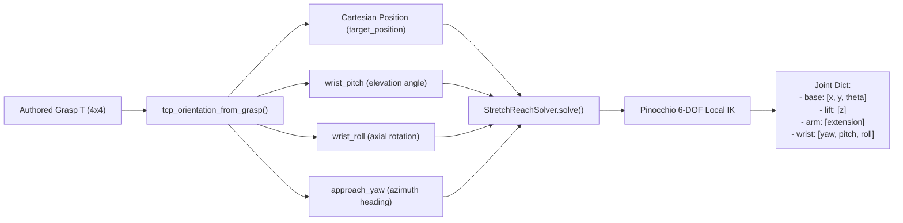

# Fine-tuning a VLA on Stretch 4

A model trained on a Franka emits Franka joint angles, and nothing in this repo
translates them any more — see *Why a Franka-space model is not simply remapped*
in [`../README.md`](../README.md). The half of the mismatch that killed the
attempt is the half kinematics cannot reach anyway: the model has never seen a
Stretch head camera, and no retarget fixes a viewpoint. So teach it Stretch.

```
datagen_configs.py   Stretch versions of MolmoSpaces' data generation configs
generate_dataset.py  run them, then optionally export -- one command
live_recorder.py     record teleop demonstrations from examples/molmo_environment.py
lerobot_export.py    rollouts -> a LeRobot v2.1 dataset (for openpi / LeRobot)
molmobot_repo.py     clone MolmoBot, fetch the scripts that are not in it, patch it
train_progress.py    a progress bar, drawn from the trainer's own log lines
training_report.py   what a run did: loss curves, learning rates, what to change
hparam_probe.py      short runs that answer one hyperparameter question
finetune.py          check the data, prepare it, write the config and a run script
```

The trajectory format itself is `../hdf5_layout.py`, one level up because
`../training/` reads it too. Behaviour cloning a small net from scratch is that
other road: [`../training/README.md`](../training/README.md).

## MolmoBot needs no conversion

[MolmoBot](https://github.com/allenai/MolmoBot) trains **directly on MolmoSpaces
trajectories**. `MolmoBot/olmo/data/synthmanip_dataset.py` opens
`{data_path}/{split}/house_*/*.h5` and reads `obs/agent/qpos`,
`actions/joint_pos_rel`, `obs_scene["task_description"]` and
`obs/sensor_data/{camera}` — which is exactly what `generate_dataset.py` writes.

And its action space is configured **by move group**: `--action_move_groups`,
`--camera_names`, `action_spec`. So it learns Stretch's own ten numbers —

| group | dims |
| --- | --- |
| `base` | 3 |
| `lift` | 1 |
| `arm` | 1 |
| `wrist` | 3 |
| `gripper` | 2 (the MJCF's mirrored pair of the one `stretch_gripper` actuator) |

— and `SynthVLAPolicy` hands MolmoSpaces back an action dict keyed by move group,
which is precisely what Stretch's controllers already take. That is why
`--policy molmobot` in `run_benchmarks.py` has no remapper in it.

```bash
# 1. prove the setup: 2 episodes, 1 house, small scene dataset
python -m examples.machine_learning.molmospaces.finetuning.generate_dataset \
    --task debug --output-dir data/stretch_debug --no-export

# 2. generate for real (--no-export: MolmoBot reads the rollouts as they are)
python -m examples.machine_learning.molmospaces.finetuning.generate_dataset \
    --task pick --task pnp --episodes 2000 --num-workers 8 \
    --output-dir data/stretch_pick --no-export

# 3. prepare the data, fetch MolmoBot, write run_molmobot.sh
python -m examples.machine_learning.molmospaces.finetuning.finetune \
    --rollouts data/stretch_pick/rollouts/pick --trainer molmobot \
    --cameras "head_right,wrist_right"

# 4. read that script, then run it: it installs MolmoBot's deps, downloads the
#    base checkpoint, builds the trajectory index its dataloader requires, trains
bash data/stretch_pick/rollouts/molmobot/pick/run_molmobot.sh

# 5. score the result -- natively, no remapping. The checkpoint is the step
#    directory, the one holding config.yaml, *not* the model_and_optim/ inside
#    it: MolmoBot's loader reads the config from the path it is given and
#    appends model_and_optim itself.
python -m examples.machine_learning.molmospaces.run_benchmarks \
    --policy molmobot --benchmark pick \
    --checkpoint data/stretch_pick/rollouts/molmobot/checkpoints/stretch4_pick/step9500_bestfit
```

There is no `--cameras` on that command, and there should not be: the checkpoint
records the cameras it was trained on, and the evaluation reads them off it. A
camera set that disagrees with training is not an error anywhere in the stack --
the images are the right shape, the model consumes them, and the policy acts
confidently on a scene it cannot see -- so the answer is taken from the one place
that cannot be wrong. Same for `--action_type`.

Step 5 also needs MolmoBot's *model* dependencies in this repository's
environment rather than the training venv inside the checkout: a rollout is a
MolmoSpaces simulation with MolmoBot's weights inside it, in one interpreter.
Nothing has to be exported -- `run_benchmarks.py` puts the checkout on the import
path itself -- but the packages have to be installed, and it says which are
missing before the benchmark loads. See `../README.md`.

> Note: On a 5090, you may need to install CUDA 12.8 and also rebuild pytorch on both the third_part/MolmoBot/MolmoBot/.venv and this repo's venv:
```
uv pip uninstall torch torchvision torchaudio -y
uv pip install torch torchvision torchaudio --index-url https://download.pytorch.org/whl/cu128
python -c "import torch; print(torch.__version__); print(torch.version.cuda); print(torch.cuda.get_arch_list()); print(torch.cuda.get_device_name(0))"
# Make sure the last command outputs sm_120, if it does, then it's set up correctly.

# `uv sync --extra train` no longer has to be commented out by hand: the
# generated script's SYNC defaults to `auto`, which syncs only when the checkout
# has no virtualenv yet -- precisely so a torch rebuilt for this card is not
# silently replaced by the one MolmoBot resolves. SYNC=on forces it.
```


Step 3 does the two mechanical things that stand between a MolmoSpaces run and a
MolmoBot dataset, both easy to miss:

- **`obs/sensor_data` is empty.** MolmoSpaces strips camera observations before
  batching to keep the HDF5 small
  (`prepare_episode_for_saving(remove_sensors_if_save_dir=True)`), so its saver
  writes that group empty *even though the MP4s are in the same directory*.
  MolmoBot reads the video filename out of it, so every trajectory would look
  image-less. `../hdf5_layout.py`'s `ensure_sensor_data_paths()` fills it in from the
  videos that are already there, under the name the saver itself would have
  used.
- **The houses are flat.** MolmoBot wants `train/` and `val/`;
  `arrange_train_val_split()` symlinks them across, moving houses *whole* so a
  room never lands in both splits.

Step 3 also clones MolmoBot (into `third_party/MolmoBot`, gitignored) and
downloads its two data-postprocessing scripts. Those are worth a note, because
MolmoBot's README references `validate_trajectories.py` and `calculate_stats.py`
as though they sat beside its trainer and **they are not in its git repository at
all** — they ship with the `allenai/molmobot-data` dataset on HuggingFace.
`molmobot_repo.py` fetches them into `third_party/MolmoBot/data_scripts/`.

It also **registers Stretch in MolmoBot's preset table**, which a fresh clone has
no way to learn. `--action_dim` and `--action_move_groups` give the trainer the
width and the names, but the *per-group* widths come only from
`ACTION_SPECS[args.action_preset]`, and with nothing matched `train_molmobot.py`
raises:

```
ValueError: Action spec must be specified via --action_preset.
```

It raises that *after* the data paths validate, so it reads like a data problem
when it is a missing preset. `molmobot_repo.ensure_stretch_presets` writes
`stretch_joint` and `stretch_jointdelta` into `synthmanip_presets.py` from
`STRETCH_ACTION_SPEC` — one source for the widths and the move-group order the
evaluation policy unpacks in — and the generated command passes
`--action_preset` instead of `--action_move_groups`. It is idempotent, leaves an
existing entry alone, and needs no patch to `train_molmobot.py`: with the preset
present that `raise` is never reached, so the trainer runs unmodified.

Of the two downloaded scripts, only `validate_trajectories.py` is load-bearing: it writes the
`valid_trajectory_index.json` that `SynthmanipDataset` raises without, once per
split directory. `calculate_stats.py` writes a `stats` group that
`train_molmobot.py` does not read on the path configured here — it normalises
with quantiles over the raw actions and min/max over raw `qpos` — so the
generated script explains that and leaves it in for the modes that do.

Nothing past writing the script runs from here. `uv sync --extra train` pulls
torch, the base checkpoint is ~20GB, and the fine-tune runs for a long time, so
all three are lines in `run_<trainer>.sh` for you to launch, not side effects of
a command that mostly inspects data.

### Continuing from your own weights, and why not a resume

A run that stopped while it was still improving wants more steps, and there are
two ways to spend them. Only one of them works here.

```bash
CHECKPOINT=data/stretch_pick/rollouts/molmobot/checkpoints/stretch4_pick/step9500_bestfit \
SAVE_FOLDER=data/stretch_pick/rollouts/molmobot/checkpoints/stretch4_pick_v2 \
MAX_STEPS=30000 \
bash data/stretch_pick/rollouts/molmobot/pick/run_molmobot.sh
```

That is a **new run from trained weights**: `select_checkpoint` accepts a
`step<N>_bestfit/` exactly as it accepts a downloaded `model.pt`, and a
checkpoint passed this way arrives as `initial_model_checkpoint`, which
`run_trainer` handles by setting `reset_train, reset_opt = True, True`. The
weights carry over; the optimizer and the step counter start fresh; the learning
rate runs one clean warmup-and-cosine over the new `MAX_STEPS`. The save folder
has to be a different one, or `allow_resume` finds the old run's `step<N>/` and
resumes from that instead.

**Resuming in place is the other way, and it is worse twice over.** `MAX_STEPS`
is the learning-rate horizon (`scheduler.t_max` is unset, so `scheduler_max` is
`max_steps`), so resuming at step 10,000 with `MAX_STEPS=30000` does not
continue the old schedule — it evaluates a *new* 30,000-step schedule at step
10,000, which jumps the action expert's rate from its decayed `1e-5` back up to
roughly `7.8e-5` in one step. And it cannot happen anyway: `train_molmobot.py`
sets `save_final_optim=False`, so `step<N>/` holds weights and no optimizer
state, and the resume path asks for `load_optimizer_state=True`.

Nothing is gained by deleting the old run. Keep `step<N>_bestfit/` — it is both
the weights the next run starts from and the baseline it has to beat. The
ordinary `step<N>/` beside it is the same size and worse (it is from after the
best), so that one is fair game for the disk.

### The base checkpoint is a directory, not a name

`train_molmobot.py`'s help calls its positional argument "Path to checkpoint or
'8b' for base model", but **nothing in the trainer maps `8b` to a model** —
`select_checkpoint` runs `os.listdir` on whatever string it is handed, so `8b`
dies with a bare `FileNotFoundError: '8b'` after the dataset has already loaded.
The default here is `allenai/MolmoBot-DROID`, whose HuggingFace repository holds
exactly the `model.pt` + `config.yaml` that `select_checkpoint` and `get_model`
accept; the generated script downloads it and passes the directory. Pass a local
path to `--base-checkpoint` to use a checkpoint you already have, or follow
MolmoBot's README to start from the Molmo2-4B VLM instead — that is the
from-scratch recipe and wants far more data than a fine-tune does.

### The tuning block, and CUDA out-of-memory

Everything worth changing sits in one block at the top of the generated script,
each value written as `${NAME:-default}` so it can be overridden for a single run
without editing:

```bash
SEQ_LEN=1024 DEVICE_BATCH=2 bash run_molmobot.sh
```

`SEQ_LEN` and `DEVICE_BATCH` are **sized at run time from `nvidia-smi`**, off the
smallest visible GPU, so the same script works on a 24GB workstation and an 80GB
node without regenerating. Pass `--seq-len` or `--device-batch-size` to
`finetune.py` to pin one instead.

| variable | why it costs memory |
| --- | --- |
| `SEQ_LEN` | The loader is built with `pad="to_max"`, so **every sample is padded to it** whether or not any trajectory needs the room. 528 is what MolmoBot's README uses for this exact shape — two images, `crop_mode=resize`, `max_crops=1`, 3×3 pooling. |
| `DEVICE_BATCH` | Samples per forward/backward. `Trainer.split_batch` chops the per-device batch into `ceil(batch / DEVICE_BATCH)` microbatches with no divisibility requirement, so 1 is always valid. MolmoBot's own default is 2. |
| `GLOBAL_BATCH` | The effective batch, made up by accumulating gradients. Changes the optimisation, not the peak — lower it only if you mean to train differently. |

The table rows in `VRAM_TIERS` are **starting points, not measurements**:
extrapolated from MolmoBot's own recipe with margin for the resident backbone.
Turn them down for more cameras, up when a run fits with room to spare.

### Wide-angle lenses, and what `--cameras_to_warp` is actually for

`head_camera_left` and `head_camera_right` are wide-angle: `stretch/config.py`
gives them a ~123° FOV and `install_fisheye_distortion_hook()` runs a barrel
distortion on every frame **at render time**, so the lens is baked into the
recorded MP4s. `head_camera` and both wrist cameras take the MJCF's default FOV
with no distortion callback.

That makes MolmoBot's `--cameras_to_warp` a trap. Its help — "apply GoPro
fisheye warping (resize to 640×480 4:3 + barrel distortion)" — reads like the
flag you want when your cameras are wide-angle, but pointed at these two it
distorts already-distorted frames and trains the policy on a lens nothing has.
The result still looks like a plausible wide-angle photo, so nothing flags it.
`WARP_CAMERAS` is therefore empty, and the generated script names which of *your*
selected cameras are already distorted and which are not. The flag's real use is
the opposite case: a camera that renders rectilinear in sim but is wide-angle on
the robot.

### LoRA, and what MolmoBot has instead

**MolmoBot has no LoRA.** There is no adapter, PEFT or low-rank code anywhere in
the repository, so there is no rank to set and no flag to expose; adding it would
mean injecting adapters into its model modules — a fork of the trainer, not a
configuration change.

What it has is whole-component freezing plus per-component learning rates, which
already satisfies two of the three usual LoRA recommendations:

- **Action head unfrozen, at a higher learning rate** — the action expert is the
  thing being trained and there is no flag to freeze it. `ACTION_EXPERT_LR`
  defaults to `1e-4`, 10× the LLM's and 20× the ViT's.
- **Everything else frozen** — which is what makes a run fit on one card.
- **Adapting the vision tower** — `TRAINABLE=vision` unfreezes it outright rather
  than through an adapter. Given the ~123° distorted head cameras and MolmoBot's
  rectilinear DROID/RBY1 pretraining, this is the first thing to try when a run
  plateaus with the tower frozen. Expect it to need a smaller `DEVICE_BATCH`.

`TRAINABLE` takes `action_expert` (default), `vision`, or `full`, and rejects
anything else rather than silently training the wrong thing. `ACTION_EXPERT_LR`,
`VIT_LR` and `LLM_LR` are exposed alongside it.

### Watching a run

MolmoBot already tracks its own progress — `Trainer.fit` prints
`[step=N/max, eta=...]` every `LOG_INTERVAL` steps, from `Trainer.get_eta()` —
but as the first line of a multi-line metrics dump, so the one number you want
scrolls past. Training is piped through `train_progress.py`, which passes every
line through untouched and appends a block whenever it sees a header:

```
  [##############------------------]  43.2%  step 12,960/30,000
  2.41 it/s  elapsed 1:29:38  eta 1 hour, 58 minutes  (trainer's own estimate)
```

Two estimates because they answer different questions: the trainer's `eta=` is
averaged over its whole run and is the one to trust for a finish time, while the
`it/s` here is measured between the headers this process has seen, so it shows
when a run has *slowed down*. The bar appends rather than repainting in place —
no carriage returns or cursor codes — so the output stays readable when piped to
a file or pasted into an issue. `LOG_INTERVAL` controls how often it redraws, and
`PROGRESS=off` skips the pipe entirely.

Below that, the optional trainer flags are listed commented-out with the reason
to reach for each — `--img_aug`, `--weighted_sampling`, `--randomize_prompts`,
`--use_point_prompts`, `--no_val`, and the `ft_*` unfreezing switches. Weights &
Biases is `WANDB=off` by default, because its config interpolates
`${oc.env:WANDB_PROJECT}` and `${oc.env:WANDB_ENTITY}` and would otherwise kill
the run *after* the checkpoint and statistics load; `WANDB=on` with both exported
turns it on, and fails immediately with a clear message if they are not.

`TRAINABLE` decides what carries gradients and optimiser state; it defaults to
`vision`, which unfreezes the tower alongside the action expert, because the
~123° distorted head cameras are a long way from MolmoBot's rectilinear DROID
pretraining. `action_expert` is the cheaper tier and the one to fall back to. The
resident weights are the floor either way: the base checkpoint is a
~4B-parameter model at `d_model=2560`, `n_layers=36`. If the smallest tier still
OOMs, drop a camera — that roughly halves the image tokens — before dropping the
batch further.

## What the run measured, and what to change

MolmoBot computes everything a fine-tune needs to be tuned and then keeps almost
none of it. `log_metrics_to_console` drops every `optim/` key but
`optim/total_grad_norm` — which this trainer never emits, since it emits
`optim/<group>_grad_norm` — and the validation loss reaches the console as a bare
`val` header hundreds of lines from the training block it belongs with. The rest
exists only in Weights & Biases, which is off by default here for the reason
above.

So `molmobot_repo.ensure_metrics_log` puts one call at the top of that method,
where the *unfiltered* metrics dict is still in hand, and the run writes
`metrics.jsonl` beside its checkpoints: one JSON line per dump, training and
validation alike, with the gradient norms, the throughput and the peak memory.
`METRICS=off` turns it off; the recorder is inert when the variable is unset.

```bash
python -m examples.machine_learning.molmospaces.finetuning.training_report \
    data/stretch_pick/rollouts/molmobot/checkpoints/stretch4_pick
```

```
loss
----
  train/action_flow_loss       first 0.36909   last 0.02858   best 0.02425 @ step 9,800
  val/action_flow_loss         first 0.27864   last 0.06702   best 0.05906 @ step 7,000

optimizer
---------
  configured lr          action_expert 1.0e-04, vit 5.0e-06, llm 1.0e-05
  trainable              action expert + vit   optimizer adamw8bit
  action_expert          |grad| median 0.987  max 13.8  (6 spikes >5x)

diagnostics
-----------
  * val: validation bottomed out at 0.05906 (step 7,000) and is 0.06702 by step 10,000.
    That is overfitting past the best fit. The step<N>_bestfit/ checkpoint is the
    one to evaluate; to spend the extra steps better, generate more episodes or
    turn on --img_aug.
```

### Every checkpoint says what state training was in

`step9500_bestfit/` on its own tells you which step it came from and nothing
else. Not what the validation loss was there, not whether the run had converged
or was still improving, not what the learning rates had decayed to — and a
checkpoint outlives the terminal that produced it, gets copied to another
machine, and turns up six weeks later as a path in a command.

So the same patch writes a `training_metrics.json` **inside** every checkpoint
directory the trainer saves — `step<N>/`, `step<N>_bestfit/` and the final one —
by wrapping the two save methods, so the summary lands after the save has
returned and one insertion covers all three:

```json
{
  "kind": "bestfit",
  "step": 9500, "max_steps": 10000,
  "train": {"loss": 0.02430, "min_loss": 0.02410, "last_logged": {"...": "the whole dump"}},
  "eval": {"synthmanip_val": {"step": 9500, "metrics": {"action_flow_loss": 0.05910}}},
  "best": {"metric": "action_flow_loss", "loss": 0.05910, "step": 9500,
           "evals_since_improvement": 0},
  "learning_rates": {"action_expert": 2.3e-06, "vit": 1.1e-07},
  "elapsed_seconds": 32271.4, "written": "2026-08-29T05:43:11"
}
```

`evals_since_improvement` is the field to read first: `0` means this checkpoint
was saved *because* the loss had just improved, so the run had not finished
getting better. The learning rates are read off the optimizer rather than out of
the metrics, because `LRMonitor` reports nothing under the 8-bit optimizer and
the decayed rate at the moment of the save is what explains the loss.

Both halves use it. The report lists the checkpoints on disk and names the one
worth evaluating:

```
checkpoints
-----------
  step9500_bestfit   train 0.02430   best action_flow_loss 0.05910 @ step 9,500   (saved on an improvement)
  step10000          train 0.02858   best action_flow_loss 0.05910 @ step 9,500   (1 evals without improvement by then)
  -> evaluate .../checkpoints/stretch4_pick/step9500_bestfit
```

and `run_benchmarks.py --policy molmobot` logs the same line as it loads, so a
benchmark's own output says whether it is scoring a converged policy or an early
one. A checkpoint saved before this existed simply says less; nothing requires
it.

The generated script runs that itself when training ends, and it is re-runnable
at any time — including while a run is going, since the file is appended to and a
half-written last line is skipped. `--csv` writes the series long-form and
`--compare` puts several runs in one table. Each diagnostic states the
measurement first and the conventional reading of it second: a plateau at a loss
you are happy with is a finished run.

### The plot, redrawn as the run goes

`run_molmobot.sh` starts a watcher beside the trainer and stops it when the run
ends, so `$SAVE_FOLDER/training.png` is a current picture of the fine-tune from
the first log line onward — leave an image viewer open on it. `PLOT=off` skips
it; `PLOT=<path>` moves it. Standalone, over any run, finished or not:

```bash
python -m examples.machine_learning.molmospaces.finetuning.training_report \
    data/stretch_pick/rollouts/molmobot/checkpoints/stretch4_pick --plot --watch
```

It polls the metrics file and redraws whenever it grows — every `LOG_INTERVAL`
steps, and so at every evaluation — printing a line each time:

```
  step 12,960/30,000  train 0.04213  best val 0.05906 @ 7,000 -> .../training.png
```

Five panels, in the order the questions come up:

| panel | what it answers |
| --- | --- |
| **loss** | Is it learning? Training loss raw and smoothed, each evaluator's validation loss, and a star on the best one. |
| **action loss by move group** | *What* is it failing to learn? `train/flow_loss_dim_*` averaged into base, lift, arm, wrist and gripper — ten anonymous curves become five that name a joint. |
| **learning rate** | Is the schedule doing what you set? Per parameter group, so the warmup ramp and the cosine decay are visible, and a group frozen at zero is obvious. |
| **gradient norm** | Is the rate too high? Spikes many times the median are what stepping too far looks like from the outside. |
| **throughput / peak GPU memory** | Has the run slowed down, and how close is it to OOM? |

Two things had to be fixed for those panels to have anything in them, both
worth knowing if you read MolmoBot's own logs. The learning rates never appeared
anywhere: torchao's 8-bit optimizer keeps `group["lr"]` as a 0-dim
`torch.Tensor`, and every filter in the path — MolmoBot's console formatter
included — is an `isinstance(value, (int, float))` check, so the numbers were
computed and dropped at every step. And the picture is written to a temporary
and renamed into place, because a viewer reloading the file on change would
otherwise catch it half-written.

Drawing needs matplotlib, which MolmoBot's virtualenv has no reason to carry, so
the plot runs under *this* repository's interpreter — recorded as `REPORT_PYTHON`
when the script is generated. The text report is stdlib-only and runs under
either.

Two things it reads that are not metrics. The learning rates come from the run's
own `config.yaml` when `LRMonitor` reported nothing — with the 8-bit optimizer it
usually does not — and so does which components were trainable, because no metric
records that at all.

## Choosing the hyperparameters

The defaults in the generated script are MolmoBot's own, chosen for DROID and
RBY1 data. They are a starting point, not an answer, and the honest way to
improve on them is to run a few short fine-tunes and compare:

```bash
python -m examples.machine_learning.molmospaces.finetuning.hparam_probe \
    --script data/stretch_pick/rollouts/molmobot/pick/run_molmobot.sh \
    --values 3e-5,1e-4,3e-4 --steps 600
```

That writes `run_probe.sh`: three runs of the **existing** script with
`ACTION_EXPERT_LR` changed and `MAX_STEPS` shortened, each into its own save
folder, followed by `training_report.py --compare`. Driving the real script
rather than reimplementing the trainer command is what keeps a probe from
drifting from the run it is supposed to predict. `--vary` takes any of the
script's other knobs (`VIT_LR`, `TRAINABLE`, `GLOBAL_BATCH`, `SEQ_LEN`), and
three of them make a sweep cheap: `PREPARE=off` after the first run skips the
data preparation, `STATS_PATH` is shared so the normalisation statistics are
computed once, and `ASSUME_YES=1` answers the preflight questions a deliberately
short run would otherwise be asked every time.

`MAX_STEPS` is the learning-rate horizon as well as the stopping point, so each
probe run is a complete miniature schedule rather than the first tenth of a long
one. That makes the runs comparable to each other and *not* to a full fine-tune:
a rate that wins over 600 steps is often a little high for 10,000. Read the
ordering, and prefer the lower of two rates that tie.

**Before tuning anything, check that the model can fit the data at all.** A sweep
compares learning rates; it cannot tell you the trajectories are mislabelled. Ask
it to memorise a handful of episodes on purpose — out of the data you already
have, so there is nothing to generate:

```bash
mkdir -p data/stretch_overfit/rollouts/tiny
for h in $(ls data/stretch_pick/rollouts/pick | grep '^house_' | head -4); do
    ln -sfn "$PWD/data/stretch_pick/rollouts/pick/$h" "data/stretch_overfit/rollouts/tiny/$h"
done

python -m examples.machine_learning.molmospaces.finetuning.finetune \
    --rollouts data/stretch_overfit/rollouts/tiny --trainer molmobot \
    --cameras "head_camera_right,wrist_camera_right" \
    --steps 300 --batch-size 8 --val-fraction 0.25
bash data/stretch_overfit/rollouts/molmobot/tiny/run_molmobot.sh
```

Sixteen or so demonstrations, three hundred steps, half an hour: the training
loss should fall to nearly nothing. If it does not, no learning rate will help —
the problem is in the data, the action spec or the camera names, and the report
says which of those it looks like.

Four houses rather than the one-house `--task debug` set because a split needs
somewhere to hold a house out: `arrange_train_val_split` holds out none when
there is only one, and the dataloader raises on a `val/` with no index in it.

## Several tasks, one policy

MolmoBot is language-conditioned on each trajectory's `task_description`, so pick
and pnp belong in **one** run and one checkpoint — training them separately gives
two models, each having forgotten the other's task. Repeat `--rollouts`:

```bash
python -m examples.machine_learning.molmospaces.finetuning.finetune \
    --rollouts data/stretch_pick/rollouts/pick \
    --rollouts data/stretch_pick/rollouts/pnp \
    --sample-rates "0.6,0.4" --trainer molmobot
```

Each task is prepared into its own `train/`+`val/` layout, every split of every
task is indexed, and the script lands in their shared parent
(`rollouts/molmobot/run_molmobot.sh`) because the run spans all of them.

Two details the generated command handles that are easy to miss by hand:

- **`--val_data_paths` is passed explicitly.** Left off, MolmoBot validates on
  the `val/` of the *first* `--data_paths` entry alone, so a two-task run reports
  pick's loss while training on both.
- **Every task needs a non-empty `val/`.** `arrange_train_val_split` holds out no
  houses when a task has only one, and an empty split has no
  `valid_trajectory_index.json` for the dataloader to open. `finetune.py` warns
  about this before you spend an hour on the earlier steps.

## The other trainers, and the LeRobot export

openpi (pi0/pi0.5) and LeRobot want a LeRobot dataset, so they take
`lerobot_export.py`'s output. It writes one action space, Stretch's own:

| | `stretch` |
| --- | --- |
| dimensions | 10 (base step, lift, arm, wrist, gripper) |
| model's action head | reshaped and re-learned |
| pretrained weights | vision and language carry over; the head does not |
| drives the base | yes |
| encoding fidelity | exact — it is what was recorded |

There used to be a `franka` default here, an 8-dimensional encoding that ran the
Franka remapping backwards so a DROID-pretrained checkpoint could keep its action
head. It is gone with the rest of the remapping. What it cost was invisible from
the outside: every recorded pose the virtual arm could not reach was quietly
replaced by the nearest one it could, the encoding was pinned to a *virtual*
Franka mounted on Stretch's mast rather than to the authoring arm, and evaluating
against the wrong frame of the two made the arm reach consistently short with
nothing in the logs to say why. A re-learned action head wants more data. It does
not want a debugging session.

## Where the demonstrations come from

**The simple_ik expert, procedurally** — `datagen_configs.py` +
`generate_dataset.py`. MolmoSpaces' data generation pipeline samples tasks
procedurally (pick a house, pick an object, place the robot, plan, roll out), so
it is unbounded and drawn from the training splits. The benchmark's own 1000
episodes are the *test set*; training on them measures memorisation. The configs
are also addressable from MolmoSpaces' entry point:

```bash
python -m molmo_spaces.data_generation.main \
    examples.machine_learning.molmospaces.finetuning.datagen_configs:StretchPickDataGenConfig
```

Each is a MolmoSpaces datagen config with three substitutions — Stretch's robot,
cameras and simple_ik expert — and the task class, sampler and success criteria
left alone, because those are what make the data comparable to the benchmark.
One thing beyond the substitution has to change: **where the robot is placed.**
The samplers put a Franka within 0.7m of the target because that is a Franka's
reach; Stretch's tool cannot come closer than 0.39m to its own base axis or go
past 0.99m. `STRETCH_PLACEMENT` widens those fields to the same 0.55–0.90m band
`../stretch/episode_overrides.py` retargets benchmark episodes into.

(`robot_object_z_offset` is deliberately *not* in that set. The samplers use it
to lift a Franka's base to a workable height, which is meaningless for Stretch —
its base is on the floor and the lift covers the vertical range. Harmlessly so:
`HoloJointsRobotBaseGroup.pose` only reads x, y and yaw, so the sampler's z is
discarded rather than obeyed.)

### `--task potato`: generating data for one object category

`potato` is `pick` narrowed to a single object class, and it is the worked example
for pointing the generator at whatever object you actually care about.

The obvious implementation is the wrong one. Restricting the sampler's
`pickup_types` to potatoes filters the *scene's own* objects, and a procthor
kitchen only sometimes has a potato in it — most houses would come back
`HouseInvalidForTask` and be abandoned, so the yield per house of simulation
would collapse.

So `StretchPotatoPickDataGenConfig` uses the sampler's **pick-from-set** mode
instead. `added_pickup_objects` puts a set of potato assets *into* the scene and
makes them the pickup targets; the scene's own objects are demoted to position
anchors, used only to find a cluttered surface to stand a potato on. Every house
that can host a pick episode at all hosts a potato pick.

```bash
python -m examples.machine_learning.molmospaces.finetuning.generate_dataset \
    --task potato --episodes 2000 --num-workers 8 \
    --output-dir data/stretch_potato --no-export
```

Four things worth knowing if you copy this for another category:

- **Added THOR prefabs arrive weighing 16–40 kg, and you must fix it.** A prefab
  under `objects/thor/` gives its collider a sensible `density="80"` but its
  visual mesh no mass at all — and the mesh carries `inertia="shell"`, so MuJoCo
  derives a mass from surface area × the default 1000 kg/m³. procthor's house
  generator writes `mass="1e-08"` on the visual geom of every prefab it inlines;
  the added-pickupable path attaches the raw prefab and does not. That single
  value is the difference between 0/8 and 3/8 episodes solved, and it is what
  `added_pickup_repair.py` applies on both the datagen and the eval path. If you
  add assets from a different source, check the mass before blaming the policy.


- **The pool is what has grasps, not what exists.** 56 assets are annotated
  `potato.n.01`; 29 of them have a grasp file, and those 29 are the iTHOR
  `Potato_*` prefabs rather than the objaverse scans. An asset without grasps
  does not merely produce worse data — the sampler raises out of
  `get_pickup_grasps()` and burns an episode attempt. `potato_pickup_uids()`
  filters on `has_valid_pickup_grasps` for that reason.
- **Don't route through `added_pickup_class_rank`.** It is the upstream way to
  select a category, and it calls `_pickupable_class_ranking()`, which reads an
  absolute `/weka/...` path that only exists inside AI2. It raises
  `FileNotFoundError` anywhere else.
- **Leave `pickup_types` alone.** In pick-from-set mode it selects the anchor
  objects, not the target, so setting it to your category reintroduces exactly
  the empty-candidate-list failure the mode exists to avoid.

`POTATO_PICKUPS_PER_HOUSE` (10) is how much of the pool each house sees; only one
potato is in the room at a time, and the sampler advances to the next one each
episode. The rest wait on a staging platform at z≈25m, directly above the house —
so if you watch a run with `--visualize` you will see a row of potatoes floating
outside the building. That is the upstream mode working as designed: they are
above the ceiling, invisible to every camera, and only the placed one is part of
the task. Set `POTATO_PICKUPS_PER_HOUSE = 1` if you would rather not see them, at
the cost of every episode in a house using the same asset.

Expected yield: **3/8** episodes solved over two `procthor-10k` houses, against
1/8 for plain `pick` on the same houses. That is *after* the mass repair above;
before it, the expert grasped the potato every time and then lost it on the lift
(`grasp lost: … drifted 0.124m`) for 0/8. If you see that signature, suspect the
object's mass before the policy.

To *score* a potato policy, see "A benchmark for a task with no release" in
[../README.md](../README.md) — the released suites have six potato episodes
between them, so the test set gets built rather than downloaded.

### Authored Grasps and Kinematics Solving

When `generate_dataset.py` runs the procedural `simple_ik` expert, it retrieves pre-authored 6-DOF grasp candidates from MolmoSpaces' asset library and solves for Stretch 4 joint configurations.



#### How Authored Grasps Affect the IK Solver's Output Pose:

1. **Orientation Decomposition (`tcp_orientation_from_grasp`)**:
   - **`target_position`**: The 3D translation where the gripper's Tool Center Point (TCP) must arrive (adjusted for `grasp_depth_m`).
   - **`wrist_pitch`**: Extracted from the approach vector's elevation relative to the horizontal plane (e.g., $\approx +\pi/2$ for top-down grasps, $0$ for horizontal grasps). Negative pitch angles that approach from below the surface are filtered out.
   - **`wrist_roll`**: The rotation of the gripper around its approach axis, which aligns the gripper finger closing plane with the object's geometry.
   - **`approach_yaw`**: The horizontal heading of the approach vector in the world frame.

2. **Candidate Filtering & Pitch Prioritization (`_authored_grasp`)**:
   - **Table Collision Filtering**: Candidates with `wrist_pitch < -0.05` are filtered out immediately to prevent approaching from below the tabletop.
   - **Top-Down Prioritization**: Surviving candidates are **sorted by descending `wrist_pitch`** ($\frac{\pi}{2} \to 0$). Overhead grasps are evaluated first because descending from above minimizes collision risk with surrounding objects and tabletop surfaces.
   - **Clearance & IK Validation**: The policy checks candidates in sorted order:
     - The object thickness along the grasp closing axis must fit within Stretch's gripper span (`_object_grasp_width < open_width`).
     - The candidate pose must be kinematically solvable by `StretchReachSolver`.
     - The first candidate satisfying both conditions is selected.

3. **Inverse Kinematics Optimization (`StretchReachSolver`)**:
   - The solver constructs a target SE(3) pose combining `target_position` with the orientation matrix $\mathbf{R}(\text{yaw}, \text{pitch}, \text{roll})$.
   - Pinocchio numerical IK computes the corresponding joint configuration:
     - **`base` $(x, y, \theta)$**: Rotates and translates the mobile base to place the shoulder at the appropriate angle and distance relative to the object (translating forward to a $0.70\text{m}$ standoff if the object is initially out of reach).
     - **`lift`**: Sets the mast height to match the vertical component ($z$), bounded to Stretch's physical mast limit ($1.10\text{m}$).
     - **`arm`**: Sets the telescoping extension along the horizontal distance.
     - **`wrist` (yaw, pitch, roll)**: Reorients the gripper fingers to match the authored closing plane and approach vector.


**You, driving** — `live_recorder.py`, via
`examples/molmo_environment.py --record_dataset`:

```bash
python -m examples.molmo_environment --dataset procthor-10k --house-index 0 \
    --keyboard --record_dataset data/teleop_pick --record-task "pick up the mug"
```

`R` starts an episode, `T` keeps it, `X` discards it. Same on-disk format, so it
feeds the same trainers with no branching downstream. Two decisions worth
knowing:

- **The action for a frame is the next frame's state.** A teleop session has no
  commanded target vector — the operator nudges velocities and the position
  controllers chase what falls out — and for a position-controlled arm the next
  observed state *is* the command, retrospectively. `actions/joint_pos_rel` is
  written from the same pair as a difference. The last frame of an episode has no
  successor and is dropped.
- **The operator delimits episodes.** Recording continuously and slicing later
  fills a dataset with the minutes spent driving between objects, and a
  demonstration of "reach for the mug" that starts thirty seconds before the
  reach teaches a policy to wait.

## Camera System & Multi-Camera Fine-Tuning

By default, dataset generation, LeRobot export, and fine-tuning support all onboard cameras on Stretch 4:

| Camera Name | MJCF Name | Optical Characteristics | Role |
| --- | --- | --- | --- |
| `head_camera` | `camera_center_link` | 45° vertical FOV pinhole, 1.62m height, pitched 35° down | Primary visual manipulation & task context |
| `wrist_camera_left` | `gripper_camera_left_rgb` | Pinhole, mounted on left side of wrist looking along gripper fingers | Close-range grasping & insertion feedback (left eye) |
| `wrist_camera_right` | `gripper_camera_right_rgb` | Pinhole, mounted on right side of wrist looking along gripper fingers | Close-range grasping & insertion feedback (right eye) |
| `head_camera_left` | `camera_left_link` | 123.4° vertical FOV wide-angle fisheye (with lens distortion) | Left peripheral & mobile base navigation |
| `head_camera_right` | `camera_right_link` | 123.2° vertical FOV wide-angle fisheye (with lens distortion) | Right peripheral & mobile base navigation |

Stretch 4's head assembly is fixed to the mast/base (all three head cameras are rigid to base yaw: turning the base turns the view with it). Camera streams are captured at **640 × 368** native 16:9 widescreen resolution by default.

### Custom Camera Selection

If you wish to fine-tune on a subset of cameras instead of all four, pass `--cameras` to `finetune.py` with names or shorthand aliases (`head`, `wrist`, `wrist_right`, `left`, `right`):

```bash
# Fine-tune MolmoBot on head and left wrist cameras only:
python -m examples.machine_learning.molmospaces.finetuning.finetune \
    --rollouts data/stretch_pick/rollouts/pick --trainer molmobot \
    --cameras "head,wrist_right"

# Fine-tune on head and stereo wrist cameras:
python -m examples.machine_learning.molmospaces.finetuning.finetune \
    --rollouts data/stretch_pick/rollouts/pick --trainer molmobot \
    --cameras "head,wrist_left,wrist_right"

# Default: trains on all four cameras ("head,wrist,left,right")
python -m examples.machine_learning.molmospaces.finetuning.finetune \
    --rollouts data/stretch_pick/rollouts/pick --trainer molmobot
```

The selected cameras are automatically propagated into:
- **MolmoBot**: The `--camera_names` launch arguments and `finetune_molmobot.json`.
- **OpenPI / LeRobot**: Filtered `features.images` keys in `finetune_openpi.json` and `finetune_lerobot.json`.
- **Benchmark Evaluation**: `StretchMolmoBotPolicyConfig.camera_names`.

## Why the fine-tune itself is not in here

The trainers live in the model's own repository — MolmoBot for MolmoBot, openpi
for pi0/pi0.5, LeRobot for ACT/diffusion/SmolVLA — each with its own JAX or
PyTorch stack, distributed launcher and checkpoint format, and none is a
dependency of this repo. Vendoring a copy would rot.

`finetune.py` does the parts that *are* this repo's business: check the data,
prepare it, pool the normalisation statistics where the trainer does not compute
its own, write the trainer config, print (or run) the command, and say how to
score the result. The config is JSON rather than the trainer's native Python
because all three resolve configs from dataclasses whose fields move between
versions — a generated module is a file that stops importing, while JSON of the
same field names stays diffable and reviewable before something spends a day on
it.

## Note on the LeRobot format

The export targets **LeRobot dataset format v2.1** — per-episode parquet under
`data/`, per-camera MP4 under `videos/`, JSON metadata under `meta/` — written
directly with pyarrow. Since `lerobot` is not installed here, the layout is
*targeted*, not validated by the library that defines it. Pass `--validate` to
check it against an installed `lerobot`, and read `meta/stretch_export.json` for
the same shape information in a form that does not depend on anyone's format
version.
