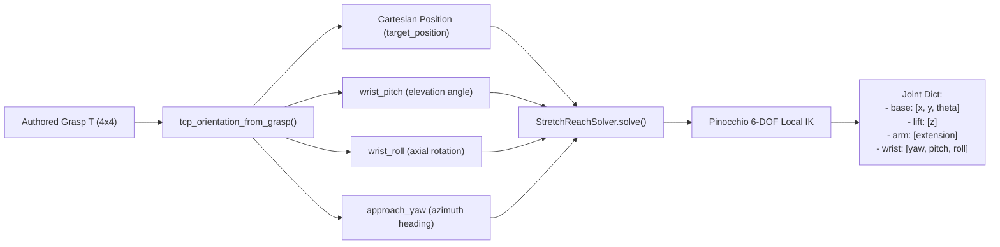

# Fine-tuning a VLA on Stretch 4

A model trained on a Franka emits Franka joint angles, and nothing in this repo
translates them any more — see *Why a Franka-space model is not simply remapped*
in [`../README.md`](../README.md). The half of the mismatch that killed the
attempt is the half kinematics cannot reach anyway: the model has never seen a
Stretch head camera, and no retarget fixes a viewpoint. So teach it Stretch.

```
datagen_configs.py   Stretch versions of MolmoSpaces' data generation configs
generate_dataset.py  run them, then optionally export -- one command
live_recorder.py     record teleop demonstrations from examples/molmo_environment.py
lerobot_export.py    rollouts -> a LeRobot v2.1 dataset (for openpi / LeRobot)
molmobot_repo.py     clone MolmoBot, fetch the scripts that are not in it
train_progress.py    a progress bar, drawn from the trainer's own log lines
finetune.py          check the data, prepare it, write the config and a run script
```

The trajectory format itself is `../hdf5_layout.py`, one level up because
`../training/` reads it too. Behaviour cloning a small net from scratch is that
other road: [`../training/README.md`](../training/README.md).

## MolmoBot needs no conversion

[MolmoBot](https://github.com/allenai/MolmoBot) trains **directly on MolmoSpaces
trajectories**. `MolmoBot/olmo/data/synthmanip_dataset.py` opens
`{data_path}/{split}/house_*/*.h5` and reads `obs/agent/qpos`,
`actions/joint_pos_rel`, `obs_scene["task_description"]` and
`obs/sensor_data/{camera}` — which is exactly what `generate_dataset.py` writes.

And its action space is configured **by move group**: `--action_move_groups`,
`--camera_names`, `action_spec`. So it learns Stretch's own ten numbers —

| group | dims |
| --- | --- |
| `base` | 3 |
| `lift` | 1 |
| `arm` | 1 |
| `wrist` | 3 |
| `gripper` | 2 (the MJCF's mirrored pair of the one `stretch_gripper` actuator) |

— and `SynthVLAPolicy` hands MolmoSpaces back an action dict keyed by move group,
which is precisely what Stretch's controllers already take. That is why
`--policy molmobot` in `run_benchmarks.py` has no remapper in it.

```bash
# 1. prove the setup: 2 episodes, 1 house, small scene dataset
python -m examples.machine_learning.molmospaces.finetuning.generate_dataset \
    --task debug --output-dir data/stretch_debug --no-export

# 2. generate for real (--no-export: MolmoBot reads the rollouts as they are)
python -m examples.machine_learning.molmospaces.finetuning.generate_dataset \
    --task pick --task pnp --episodes 2000 --num-workers 8 \
    --output-dir data/stretch_pick --no-export

# 3. prepare the data, fetch MolmoBot, write run_molmobot.sh
python -m examples.machine_learning.molmospaces.finetuning.finetune \
    --rollouts data/stretch_pick/rollouts/pick --trainer molmobot \
    --cameras "head_right,wrist_right"

# 4. read that script, then run it: it installs MolmoBot's deps, downloads the
#    base checkpoint, builds the trajectory index its dataloader requires, trains
bash data/stretch_pick/rollouts/molmobot/pick/run_molmobot.sh

# 5. score the result -- natively, no remapping
python -m examples.machine_learning.molmospaces.run_benchmarks \
    --policy molmobot --checkpoint <checkpoint> --benchmark pick
```

Step 3 does the two mechanical things that stand between a MolmoSpaces run and a
MolmoBot dataset, both easy to miss:

- **`obs/sensor_data` is empty.** MolmoSpaces strips camera observations before
  batching to keep the HDF5 small
  (`prepare_episode_for_saving(remove_sensors_if_save_dir=True)`), so its saver
  writes that group empty *even though the MP4s are in the same directory*.
  MolmoBot reads the video filename out of it, so every trajectory would look
  image-less. `../hdf5_layout.py`'s `ensure_sensor_data_paths()` fills it in from the
  videos that are already there, under the name the saver itself would have
  used.
- **The houses are flat.** MolmoBot wants `train/` and `val/`;
  `arrange_train_val_split()` symlinks them across, moving houses *whole* so a
  room never lands in both splits.

Step 3 also clones MolmoBot (into `third_party/MolmoBot`, gitignored) and
downloads its two data-postprocessing scripts. Those are worth a note, because
MolmoBot's README references `validate_trajectories.py` and `calculate_stats.py`
as though they sat beside its trainer and **they are not in its git repository at
all** — they ship with the `allenai/molmobot-data` dataset on HuggingFace.
`molmobot_repo.py` fetches them into `third_party/MolmoBot/data_scripts/`.

Of the two, only `validate_trajectories.py` is load-bearing: it writes the
`valid_trajectory_index.json` that `SynthmanipDataset` raises without, once per
split directory. `calculate_stats.py` writes a `stats` group that
`train_molmobot.py` does not read on the path configured here — it normalises
with quantiles over the raw actions and min/max over raw `qpos` — so the
generated script explains that and leaves it in for the modes that do.

Nothing past writing the script runs from here. `uv sync --extra train` pulls
torch, the base checkpoint is ~20GB, and the fine-tune runs for a long time, so
all three are lines in `run_<trainer>.sh` for you to launch, not side effects of
a command that mostly inspects data.

### The base checkpoint is a directory, not a name

`train_molmobot.py`'s help calls its positional argument "Path to checkpoint or
'8b' for base model", but **nothing in the trainer maps `8b` to a model** —
`select_checkpoint` runs `os.listdir` on whatever string it is handed, so `8b`
dies with a bare `FileNotFoundError: '8b'` after the dataset has already loaded.
The default here is `allenai/MolmoBot-DROID`, whose HuggingFace repository holds
exactly the `model.pt` + `config.yaml` that `select_checkpoint` and `get_model`
accept; the generated script downloads it and passes the directory. Pass a local
path to `--base-checkpoint` to use a checkpoint you already have, or follow
MolmoBot's README to start from the Molmo2-4B VLM instead — that is the
from-scratch recipe and wants far more data than a fine-tune does.

### The tuning block, and CUDA out-of-memory

Everything worth changing sits in one block at the top of the generated script,
each value written as `${NAME:-default}` so it can be overridden for a single run
without editing:

```bash
SEQ_LEN=1024 DEVICE_BATCH=2 bash run_molmobot.sh
```

`SEQ_LEN` and `DEVICE_BATCH` are **sized at run time from `nvidia-smi`**, off the
smallest visible GPU, so the same script works on a 24GB workstation and an 80GB
node without regenerating. Pass `--seq-len` or `--device-batch-size` to
`finetune.py` to pin one instead.

| variable | why it costs memory |
| --- | --- |
| `SEQ_LEN` | The loader is built with `pad="to_max"`, so **every sample is padded to it** whether or not any trajectory needs the room. 528 is what MolmoBot's README uses for this exact shape — two images, `crop_mode=resize`, `max_crops=1`, 3×3 pooling. |
| `DEVICE_BATCH` | Samples per forward/backward. `Trainer.split_batch` chops the per-device batch into `ceil(batch / DEVICE_BATCH)` microbatches with no divisibility requirement, so 1 is always valid. MolmoBot's own default is 2. |
| `GLOBAL_BATCH` | The effective batch, made up by accumulating gradients. Changes the optimisation, not the peak — lower it only if you mean to train differently. |

The table rows in `VRAM_TIERS` are **starting points, not measurements**:
extrapolated from MolmoBot's own recipe with margin for the resident backbone.
Turn them down for more cameras, up when a run fits with room to spare.

### Watching a run

MolmoBot already tracks its own progress — `Trainer.fit` prints
`[step=N/max, eta=...]` every `LOG_INTERVAL` steps, from `Trainer.get_eta()` —
but as the first line of a multi-line metrics dump, so the one number you want
scrolls past. Training is piped through `train_progress.py`, which passes every
line through untouched and appends a block whenever it sees a header:

```
  [##############------------------]  43.2%  step 12,960/30,000
  2.41 it/s  elapsed 1:29:38  eta 1 hour, 58 minutes  (trainer's own estimate)
```

Two estimates because they answer different questions: the trainer's `eta=` is
averaged over its whole run and is the one to trust for a finish time, while the
`it/s` here is measured between the headers this process has seen, so it shows
when a run has *slowed down*. The bar appends rather than repainting in place —
no carriage returns or cursor codes — so the output stays readable when piped to
a file or pasted into an issue. `LOG_INTERVAL` controls how often it redraws, and
`PROGRESS=off` skips the pipe entirely.

Below that, the optional trainer flags are listed commented-out with the reason
to reach for each — `--img_aug`, `--weighted_sampling`, `--randomize_prompts`,
`--use_point_prompts`, `--no_val`, and the `ft_*` unfreezing switches. Weights &
Biases is `WANDB=off` by default, because its config interpolates
`${oc.env:WANDB_PROJECT}` and `${oc.env:WANDB_ENTITY}` and would otherwise kill
the run *after* the checkpoint and statistics load; `WANDB=on` with both exported
turns it on, and fails immediately with a clear message if they are not.

The LLM, vision tower and connector are all frozen (`ft_llm`, `ft_vit` and
`ft_connector` default to `False` and nothing here turns them on), so only the
action expert carries gradients and optimiser state. The resident weights are the
floor: the base checkpoint is a ~4B-parameter model at `d_model=2560`,
`n_layers=36`. If the smallest tier still OOMs, drop a camera — that roughly
halves the image tokens — before dropping the batch further.

## Several tasks, one policy

MolmoBot is language-conditioned on each trajectory's `task_description`, so pick
and pnp belong in **one** run and one checkpoint — training them separately gives
two models, each having forgotten the other's task. Repeat `--rollouts`:

```bash
python -m examples.machine_learning.molmospaces.finetuning.finetune \
    --rollouts data/stretch_pick/rollouts/pick \
    --rollouts data/stretch_pick/rollouts/pnp \
    --sample-rates "0.6,0.4" --trainer molmobot
```

Each task is prepared into its own `train/`+`val/` layout, every split of every
task is indexed, and the script lands in their shared parent
(`rollouts/molmobot/run_molmobot.sh`) because the run spans all of them.

Two details the generated command handles that are easy to miss by hand:

- **`--val_data_paths` is passed explicitly.** Left off, MolmoBot validates on
  the `val/` of the *first* `--data_paths` entry alone, so a two-task run reports
  pick's loss while training on both.
- **Every task needs a non-empty `val/`.** `arrange_train_val_split` holds out no
  houses when a task has only one, and an empty split has no
  `valid_trajectory_index.json` for the dataloader to open. `finetune.py` warns
  about this before you spend an hour on the earlier steps.

## The other trainers, and the LeRobot export

openpi (pi0/pi0.5) and LeRobot want a LeRobot dataset, so they take
`lerobot_export.py`'s output. It writes one action space, Stretch's own:

| | `stretch` |
| --- | --- |
| dimensions | 10 (base step, lift, arm, wrist, gripper) |
| model's action head | reshaped and re-learned |
| pretrained weights | vision and language carry over; the head does not |
| drives the base | yes |
| encoding fidelity | exact — it is what was recorded |

There used to be a `franka` default here, an 8-dimensional encoding that ran the
Franka remapping backwards so a DROID-pretrained checkpoint could keep its action
head. It is gone with the rest of the remapping. What it cost was invisible from
the outside: every recorded pose the virtual arm could not reach was quietly
replaced by the nearest one it could, the encoding was pinned to a *virtual*
Franka mounted on Stretch's mast rather than to the authoring arm, and evaluating
against the wrong frame of the two made the arm reach consistently short with
nothing in the logs to say why. A re-learned action head wants more data. It does
not want a debugging session.

## Where the demonstrations come from

**The simple_ik expert, procedurally** — `datagen_configs.py` +
`generate_dataset.py`. MolmoSpaces' data generation pipeline samples tasks
procedurally (pick a house, pick an object, place the robot, plan, roll out), so
it is unbounded and drawn from the training splits. The benchmark's own 1000
episodes are the *test set*; training on them measures memorisation. The configs
are also addressable from MolmoSpaces' entry point:

```bash
python -m molmo_spaces.data_generation.main \
    examples.machine_learning.molmospaces.finetuning.datagen_configs:StretchPickDataGenConfig
```

Each is a MolmoSpaces datagen config with three substitutions — Stretch's robot,
cameras and simple_ik expert — and the task class, sampler and success criteria
left alone, because those are what make the data comparable to the benchmark.
One thing beyond the substitution has to change: **where the robot is placed.**
The samplers put a Franka within 0.7m of the target because that is a Franka's
reach; Stretch's tool cannot come closer than 0.39m to its own base axis or go
past 0.99m. `STRETCH_PLACEMENT` widens those fields to the same 0.55–0.90m band
`../stretch/episode_overrides.py` retargets benchmark episodes into.

(`robot_object_z_offset` is deliberately *not* in that set. The samplers use it
to lift a Franka's base to a workable height, which is meaningless for Stretch —
its base is on the floor and the lift covers the vertical range. Harmlessly so:
`HoloJointsRobotBaseGroup.pose` only reads x, y and yaw, so the sampler's z is
discarded rather than obeyed.)

### Authored Grasps and Kinematics Solving

When `generate_dataset.py` runs the procedural `simple_ik` expert, it retrieves pre-authored 6-DOF grasp candidates from MolmoSpaces' asset library and solves for Stretch 4 joint configurations.



#### How Authored Grasps Affect the IK Solver's Output Pose:

1. **Orientation Decomposition (`tcp_orientation_from_grasp`)**:
   - **`target_position`**: The 3D translation where the gripper's Tool Center Point (TCP) must arrive (adjusted for `grasp_depth_m`).
   - **`wrist_pitch`**: Extracted from the approach vector's elevation relative to the horizontal plane (e.g., $\approx +\pi/2$ for top-down grasps, $0$ for horizontal grasps). Negative pitch angles that approach from below the surface are filtered out.
   - **`wrist_roll`**: The rotation of the gripper around its approach axis, which aligns the gripper finger closing plane with the object's geometry.
   - **`approach_yaw`**: The horizontal heading of the approach vector in the world frame.

2. **Candidate Filtering & Pitch Prioritization (`_authored_grasp`)**:
   - **Table Collision Filtering**: Candidates with `wrist_pitch < -0.05` are filtered out immediately to prevent approaching from below the tabletop.
   - **Top-Down Prioritization**: Surviving candidates are **sorted by descending `wrist_pitch`** ($\frac{\pi}{2} \to 0$). Overhead grasps are evaluated first because descending from above minimizes collision risk with surrounding objects and tabletop surfaces.
   - **Clearance & IK Validation**: The policy checks candidates in sorted order:
     - The object thickness along the grasp closing axis must fit within Stretch's gripper span (`_object_grasp_width < open_width`).
     - The candidate pose must be kinematically solvable by `StretchReachSolver`.
     - The first candidate satisfying both conditions is selected.

3. **Inverse Kinematics Optimization (`StretchReachSolver`)**:
   - The solver constructs a target SE(3) pose combining `target_position` with the orientation matrix $\mathbf{R}(\text{yaw}, \text{pitch}, \text{roll})$.
   - Pinocchio numerical IK computes the corresponding joint configuration:
     - **`base` $(x, y, \theta)$**: Rotates and translates the mobile base to place the shoulder at the appropriate angle and distance relative to the object (translating forward to a $0.70\text{m}$ standoff if the object is initially out of reach).
     - **`lift`**: Sets the mast height to match the vertical component ($z$), bounded to Stretch's physical mast limit ($1.10\text{m}$).
     - **`arm`**: Sets the telescoping extension along the horizontal distance.
     - **`wrist` (yaw, pitch, roll)**: Reorients the gripper fingers to match the authored closing plane and approach vector.


**You, driving** — `live_recorder.py`, via
`examples/molmo_environment.py --record_dataset`:

```bash
python -m examples.molmo_environment --dataset procthor-10k --house-index 0 \
    --keyboard --record_dataset data/teleop_pick --record-task "pick up the mug"
```

`R` starts an episode, `T` keeps it, `X` discards it. Same on-disk format, so it
feeds the same trainers with no branching downstream. Two decisions worth
knowing:

- **The action for a frame is the next frame's state.** A teleop session has no
  commanded target vector — the operator nudges velocities and the position
  controllers chase what falls out — and for a position-controlled arm the next
  observed state *is* the command, retrospectively. `actions/joint_pos_rel` is
  written from the same pair as a difference. The last frame of an episode has no
  successor and is dropped.
- **The operator delimits episodes.** Recording continuously and slicing later
  fills a dataset with the minutes spent driving between objects, and a
  demonstration of "reach for the mug" that starts thirty seconds before the
  reach teaches a policy to wait.

## Camera System & Multi-Camera Fine-Tuning

By default, dataset generation, LeRobot export, and fine-tuning support all onboard cameras on Stretch 4:

| Camera Name | MJCF Name | Optical Characteristics | Role |
| --- | --- | --- | --- |
| `head_camera` | `camera_center_link` | 45° vertical FOV pinhole, 1.62m height, pitched 35° down | Primary visual manipulation & task context |
| `wrist_camera_left` | `gripper_camera_left_rgb` | Pinhole, mounted on left side of wrist looking along gripper fingers | Close-range grasping & insertion feedback (left eye) |
| `wrist_camera_right` | `gripper_camera_right_rgb` | Pinhole, mounted on right side of wrist looking along gripper fingers | Close-range grasping & insertion feedback (right eye) |
| `head_camera_left` | `camera_left_link` | 123.4° vertical FOV wide-angle fisheye (with lens distortion) | Left peripheral & mobile base navigation |
| `head_camera_right` | `camera_right_link` | 123.2° vertical FOV wide-angle fisheye (with lens distortion) | Right peripheral & mobile base navigation |

Stretch 4's head assembly is fixed to the mast/base (all three head cameras are rigid to base yaw: turning the base turns the view with it). Camera streams are captured at **640 × 368** native 16:9 widescreen resolution by default.

### Custom Camera Selection

If you wish to fine-tune on a subset of cameras instead of all four, pass `--cameras` to `finetune.py` with names or shorthand aliases (`head`, `wrist`, `wrist_right`, `left`, `right`):

```bash
# Fine-tune MolmoBot on head and left wrist cameras only:
python -m examples.machine_learning.molmospaces.finetuning.finetune \
    --rollouts data/stretch_pick/rollouts/pick --trainer molmobot \
    --cameras "head,wrist_right"

# Fine-tune on head and stereo wrist cameras:
python -m examples.machine_learning.molmospaces.finetuning.finetune \
    --rollouts data/stretch_pick/rollouts/pick --trainer molmobot \
    --cameras "head,wrist_left,wrist_right"

# Default: trains on all four cameras ("head,wrist,left,right")
python -m examples.machine_learning.molmospaces.finetuning.finetune \
    --rollouts data/stretch_pick/rollouts/pick --trainer molmobot
```

The selected cameras are automatically propagated into:
- **MolmoBot**: The `--camera_names` launch arguments and `finetune_molmobot.json`.
- **OpenPI / LeRobot**: Filtered `features.images` keys in `finetune_openpi.json` and `finetune_lerobot.json`.
- **Benchmark Evaluation**: `StretchMolmoBotPolicyConfig.camera_names`.

## Why the fine-tune itself is not in here

The trainers live in the model's own repository — MolmoBot for MolmoBot, openpi
for pi0/pi0.5, LeRobot for ACT/diffusion/SmolVLA — each with its own JAX or
PyTorch stack, distributed launcher and checkpoint format, and none is a
dependency of this repo. Vendoring a copy would rot.

`finetune.py` does the parts that *are* this repo's business: check the data,
prepare it, pool the normalisation statistics where the trainer does not compute
its own, write the trainer config, print (or run) the command, and say how to
score the result. The config is JSON rather than the trainer's native Python
because all three resolve configs from dataclasses whose fields move between
versions — a generated module is a file that stops importing, while JSON of the
same field names stays diffable and reviewable before something spends a day on
it.

## Note on the LeRobot format

The export targets **LeRobot dataset format v2.1** — per-episode parquet under
`data/`, per-camera MP4 under `videos/`, JSON metadata under `meta/` — written
directly with pyarrow. Since `lerobot` is not installed here, the layout is
*targeted*, not validated by the library that defines it. Pass `--validate` to
check it against an installed `lerobot`, and read `meta/stretch_export.json` for
the same shape information in a form that does not depend on anyone's format
version.
